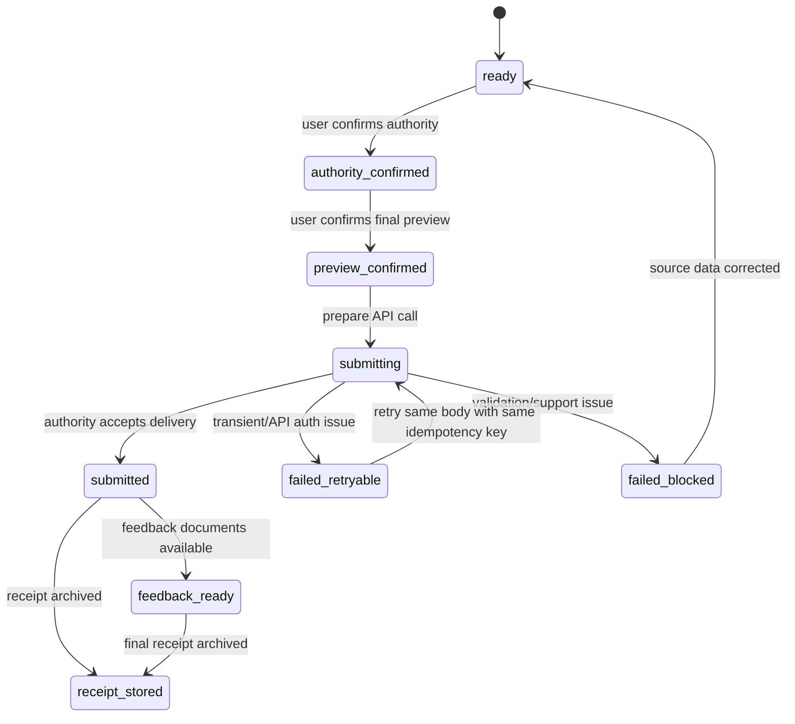

# Production Submission State

Status: design baseline for direct filing  
Applies to: `aksjonærregisteroppgaven`, `årsregnskap`, `skattemelding for AS`

Production filing is not a single button that sends a payload. It is a state machine with explicit user authority, preview confirmation, idempotent API calls, feedback handling, receipt storage, and billing gates.

## State Machine

## Hard Gates

Production API calls require:

- Filing readiness status is `ready`.
- Case is inside Talli support boundary.
- User has confirmed authority to submit for the company.
- User has reviewed and confirmed the final filing preview.
- Billing gate has passed.
- Any filing-specific production blockers are clear, including RF-1086 live-scope exclusions.

## Idempotency Policy

- Store every logical API call with endpoint, body hash, idempotency key, status, and timestamp.
- Reuse an idempotency key only for the same endpoint and identical body.
- Generate a new key if the body changes.
- Treat `GLD_019` as a state reconciliation problem, not as a blind retry.

## Failure Policy

Retryable:

- Token/authentication expiry.
- Network timeout before response.
- Temporary authority unavailability.

Blocked:

- Payload validation failure.
- Hovedskjema/underskjema mismatch.
- Unsupported tax/accounting case.
- Missing user authority.
- Missing final preview confirmation.
- RF-1086 event type excluded from live scope.

## Receipt Archive

For every successful production filing, archive:

- Submitted preview.
- Exact XML/API payload or generated filing document.
- API call records and idempotency keys.
- Authority response ids.
- Feedback documents.
- Final receipt id.
- User confirmations.

Implementation anchor: `holding_core.submission`.
