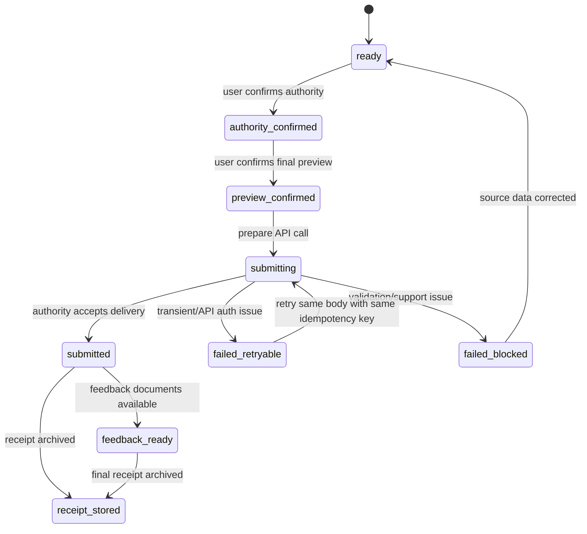

# Production Submission State

Status: RF-1086 and supported company-tax flows accepted end-to-end in TT02; every production transport remains disabled

Applies to: `aksjonærregisteroppgaven`, `årsregnskap`, `skattemelding for AS`

Production filing is not a single button that sends a payload. It is a state machine with explicit user authority, preview confirmation, idempotent API calls, feedback handling, receipt storage, and billing gates.

## State Machine

```mermaid
stateDiagram-v2
    [*] --> ready
    ready --> authority_confirmed: user confirms authority
    authority_confirmed --> preview_confirmed: user confirms final preview
    preview_confirmed --> submitting: prepare API call
    submitting --> submitted: authority accepts delivery
    submitted --> feedback_ready: feedback documents available
    submitted --> receipt_stored: receipt archived
    feedback_ready --> receipt_stored: final receipt archived
    submitting --> failed_retryable: transient/API auth issue
    submitting --> failed_blocked: validation/support issue
    failed_retryable --> submitting: retry same body with same idempotency key
    failed_blocked --> ready: source data corrected
```

## Hard Gates

Production API calls require:

- Filing readiness status is `ready`.
- The obligation-specific production adapter is implemented and enabled.
- Case is inside Talli support boundary.
- User has confirmed authority to submit for the company.
- User has reviewed and confirmed the final filing preview.
- Billing gate has passed.
- Any filing-specific production blockers are clear, including RF-1086 live-scope exclusions.

## Idempotency Policy

- Store every logical API call with endpoint, body hash, idempotency key, status, and timestamp.
- Reuse an idempotency key only for the same endpoint and identical body.
- Generate a new key if the body changes.
- Treat `GLD_019` as a state reconciliation problem, not as a blind retry.

## Failure Policy

Retryable:

- Token/authentication expiry.
- Network timeout before response.
- Temporary authority unavailability.

Blocked:

- Payload validation failure.
- Hovedskjema/underskjema mismatch.
- Unsupported tax/accounting case.
- Missing user authority.
- Missing final preview confirmation.
- RF-1086 event type excluded from live scope.

## Receipt Archive

For every successful production filing, archive:

- Submitted preview.
- Exact XML/API payload or generated filing document.
- API call records and idempotency keys.
- Authority response ids.
- Feedback documents.
- Final receipt id.
- User confirmations.

Implementation anchor: `holding_core.submission`.

Adapter and release anchors:

- `app/lib/authority-adapters.ts` defines the transport plans, reports RF-1086
  as implemented/disabled, and keeps the other transports
  unimplemented/disabled.
- `app/lib/maskinporten.ts` and `app/lib/rf1086-authority-client.ts` implement
  the opaque-token and Skatteetaten XML transport without enabling production.
- `app/lib/company-tax-return-authority-client.ts` implements test-only current
  document, validation, Altinn instance/upload, scan, and asynchronous result
  calls. The supported current-draft-bound flow completed TT02 instance upload,
  clean scan, preflight and asynchronous `validertOK`, personal owner signing,
  official feedback receipt, and archive verification. The constructor still
  refuses production.
- `app/lib/authority-test-evidence.ts` and the owner workspace implement a
  company/year-bound, step-up-protected import for completed company-tax TT02
  evidence. It validates exact scopes/app/data types, `validertOK`, personal
  confirmation handoff, receipt and archive metadata, writes only a `pending`
  `authority_test_runs` row plus audit metadata, and never enables production.
  Sanitized company-tax receipt/archive evidence is complete. Deployed import,
  final `filing_submissions` feedback/state integration, production permission
  and credentials, security/restore review, and named approval remain release
  gates.
- `app/lib/filing-release-gate.ts` adds `production_adapter_unimplemented` or
  `production_adapter_disabled` even if permissions, evidence, billing, MFA,
  and human signoff records are otherwise present.
- `docs/filing/authority-adapter-plans.md` records the external steps and the
  evidence required to enable an adapter.
- `docs/filing/skatteetaten-production-access-research.md` and
  `docs/filing/skatteetaten-production-access-application.md` record the current
  official company-tax production prerequisites and the not-yet-submitted
  application packet. They are evidence inputs, not runtime enablement.
