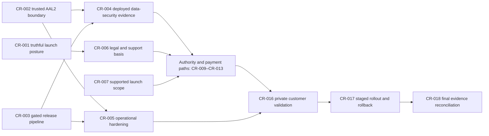

# Customer-ready decision map

Status: active launch map  
Last audited: 2026-07-15  
Code baseline: `main` including PR #105 (merge `c796104`)
Scope authority: `docs/remarks/holdingswift_produktkrav.md` and the approved PRDs  

Founder decisions that resolve the launch-scope questions are recorded in
[`2026-07-15-customer-ready-foundation-design.md`](../superpowers/specs/2026-07-15-customer-ready-foundation-design.md).
The executable test-first sequence is recorded in
[`2026-07-15-customer-ready-foundation.md`](../superpowers/plans/2026-07-15-customer-ready-foundation.md).

This is the canonical dependency map from the current product to a customer-ready
Talli release. Detailed evidence remains in the existing launch, filing, legal,
security, and billing documents. This file answers only what remains, why it
remains, and what evidence closes it.

Production filing, live charging, and live bank/OCR adapters must stay disabled
until their own release gates are complete. Passing local tests or deploying the
web application does not authorize a production submission.

The controlled RF-1086 production-pilot foundation is implemented on
`codex/controlled-production-beta`: exact operator entitlements, immutable owner
approval, a production-only credential boundary, append-only idempotent journal,
and honest authority states. The adapter remains disabled until the external
production-access, legal/security/restore/monitoring, authority, and founder gates
are evidenced. Company tax and annual accounts remain unimplemented in production.

## Definition of customer-ready

The first customer-ready release is intentionally narrow:

- Norwegian holding companies (AS) inside the documented supported-case boundary.
- Truthful public claims, an identified legal operator, approved terms/privacy,
  support ownership, and an explicit list of unsupported cases.
- Tenant-isolated production data, private evidence storage, tested recovery,
  trusted MFA/AAL2 checks, monitoring, and a rehearsed rollback.
- At least one fully evidenced end-to-end path for every feature sold as live.
- Filing and payment features are enabled independently; a disabled integration is
  described as unavailable or beta, never presented as a completed delivery path.
- CSV/manual document intake is sufficient for the first launch unless CR-007 is
  explicitly changed. Live bank feeds and OCR are not implicit launch blockers.

## Current launch posture

### Live customer rehearsal findings (2026-07-15)

- Google login/logout, company workspace access, CSV import, one expense
  reconciliation, private PDF upload, and signed retrieval worked at
  `https://talli.no`.
- A supported share-purchase preview reached the atomic write boundary but failed.
  The live PostgREST contract proves that `record_share_purchase_fifo`,
  `record_share_sale_fifo`, and all schema artifacts from migrations `0002+` are
  absent from project `oytdpbtzoibocshwunss`. The repository migrations exist and
  pass local static coverage; deployed migration parity is therefore the first
  P0 repair.
- The same missing optional feature tables make the aggregate workspace loader
  report `Tilkobling: Feil` even though baseline workspace reads and writes work.
- A posted `admin_cost` is present, but a never-saved year-end interview starts all
  activity answers as false. The UI therefore can say `Ingen aktivitet registrert
  i året` despite persisted ledger activity. Registered positive facts must seed
  the interview; confirmations that cannot be derived remain owner-controlled.
- Filing previews correctly expose unmet readiness gates, company-tax and annual-
  accounts submission remain marked under development, billing is inactive, and
  owner-dividend documents remain disabled pending professional review. These are
  truthful external gates, not defects to bypass.
- The executable repair order and acceptance criteria are recorded in
  [`2026-07-15-live-customer-readiness-repair.md`](../superpowers/plans/2026-07-15-live-customer-readiness-repair.md).

Repair execution status on 2026-07-15:

- hosted migrations now match the repository through
  `20260715143000_retention_safe_document_removal`; the 20-path deployed contract
  passes, the workspace reports a healthy connection, and an authenticated
  Test-Norge purchase persisted one action, ledger entry, position, and FIFO lot;
- year-end activity is reconciled from persisted positions, actions, and costs, so
  a saved or unsaved false answer cannot create a no-activity contradiction;
- synthetic accounting values were removed from customer forms and dashboard next
  steps now lead to the dedicated filing, transaction, and year-end journeys;
- accidental unlinked uploads have an owner-confirmed, audited removal flow, while
  linked accounting, filing, and corporate evidence remains immutable. See
  [`hosted-schema-parity-2026-07-15.md`](evidence/hosted-schema-parity-2026-07-15.md).
- the promoted application SHA passed a signed-in Safari rehearsal across the
  workspace, dashboard, actions, transactions, year-end, documents, filing,
  billing, and a mobile-sized viewport. See
  [`customer-ready-browser-rehearsal-2026-07-15.md`](evidence/customer-ready-browser-rehearsal-2026-07-15.md).

- `main` is verified and deployed; `https://talli.no` responds publicly.
- The local launch rehearsal, build, official company-tax XSD validation, audit,
  and whitespace checks pass at the baseline commit.
- Production filing adapters and live charging are still disabled, correctly.
- TT02 evidence exists for RF-1086, annual accounts, and company tax, but the
  evidence, authority outcomes, and production-access state are incomplete by
  flow.
- GitHub Actions now requires application and isolated-database readiness jobs to
  pass one aggregate `Release gate`. The clean PR run and branch-protection
  evidence are recorded in
  [`customer-ready-release-gate-2026-07-15.md`](evidence/customer-ready-release-gate-2026-07-15.md).
- A fresh local Supabase stack now applies every migration, reports zero blocking
  advisor findings, denies owner and outsider access to legacy `step_up_events`,
  passes tenant-isolation tests, and completes the persisted owner browser loop.
  This is local evidence only; hosted staging/production RLS, storage, MFA, and
  restore evidence remains unrecorded.
- `main` replaces homepage overclaims with an invite-only free
  beta posture, removes human-review/accountant-replacement/live-delivery claims,
  and identifies ELMER WELFIS, org.nr. 930 835 978. The rendered browser and
  deployment evidence is recorded above.
- `main` replaces the forgeable `step_up_events` trust path
  with verified Supabase `getClaims()` AAL2/AMR checks, revokes customer grants and
  policies, and protects corporate RPCs with signed `auth.jwt()` claims. A real
  hosted MFA enrollment/recovery/session-age rehearsal remains required.
- `founder_production_go_live` is a mandatory operator-only signoff and is
  intentionally missing. Production filing, live charging, and paid-customer
  admission require a later explicit founder confirmation after all evidence
  gates pass.

## Critical path

CR-001, CR-002, and CR-003 can run in parallel. External authority work should be
started early, but no adapter is enabled before the shared security, legal, and
deployed-evidence gates are closed.

## Decision tickets

### CR-001 — Make the public launch posture truthful

- Priority: P0
- Type: Prototype
- Blocked by: none
- Question: What may Talli promise while filing and payment adapters are disabled?
- Answer: Implemented on the customer-ready branch as a restricted, invite-only
  free beta/pre-production service. Remove or qualify
  accountant-replacement, delivery, submission, and pay-at-submission claims until
  the corresponding live evidence exists. Add the non-affiliation and supported-
  case boundary to the public journey.
- Exit evidence: homepage, onboarding, pricing, dashboard, email, and legal copy
  share one canonical capability state; automated copy tests inspect public routes;
  product/legal owner signs the rendered public copy.

### CR-002 — Replace forgeable step-up records with a trusted AAL2 boundary

- Priority: P0 security blocker
- Type: Prototype
- Blocked by: none
- Question: Can a customer manufacture the security state required for a sensitive
  action?
- Answer: The baseline was vulnerable: `authenticated` could insert its own `step_up_events` row,
  including `mfa_verified_at`, `security_review_approved`, and
  `production_credentials_enabled`, while application and corporate-document
  guards trust those fields. Use the signed Supabase JWT `aal=aal2` claim for user
  presence, revoke customer writes to trusted security state, and store human
  security approval and production-credential enablement in a server/operator-only
  boundary. The corrective application and database boundary now passes local
  unit, fresh-PostgreSQL, local Supabase RLS/advisor, and browser-loop tests.
- Exit evidence: corrective migration; all sensitive actions/RPCs use the trusted
  boundary; direct-insert and forged-timestamp adversarial tests fail safely; real
  enrollment, challenge, recovery, and session-age paths pass in a deployed test.

### CR-003 — Put a release gate in front of production deployment

- Priority: P0 operational blocker
- Type: Prototype
- Blocked by: none
- Question: How does a change prove readiness before reaching `talli.no`?
- Answer: Implemented in PR #105. Pull requests and `main` run pinned, least-
  privilege CI for typecheck, the complete launch rehearsal, a production build,
  dependency audit, credential scan, whitespace checks, official-XSD validation,
  and a fresh local Supabase migration/advisor/RLS/storage/browser-owner loop. The
  official schema repository is pinned to `v1.62.47`, and the browser/runtime
  dependencies are installed deterministically on the clean runner. Vercel keeps
  preview and production targets separate; only checked changes may reach the
  protected `main` production branch.
- Exit evidence: PR #105 passed aggregate `Release gate` run `29421206393`; an
  earlier missing-browser run failed closed and did not reach `main`; `main`
  protection requires the `Release gate`, including for administrators; force
  pushes and branch deletion are disabled. See the linked evidence record.

### CR-004 — Produce deployed database, storage, and recovery evidence

- Priority: P0 launch blocker
- Type: Research
- Blocked by: CR-002, CR-003
- Question: Does tenant isolation and recovery work in the actual hosted target?
- Answer: Not yet proven. Run the authenticated RLS/private-storage suite and all
  filing-evidence import paths against an identified staging project, then the
  production configuration. Run an isolated backup/restore and verify relational
  rows plus private objects. Resolve or explicitly accept every Supabase security
  and performance advisor finding.
- Exit evidence: target/project identifiers, migration versions, operator, time,
  command/result logs, cross-tenant denials, signed-URL expiry checks, restored
  object hashes, recovery time, and a `security_restore` runtime signoff no older
  than 30 days.

### CR-005 — Add the missing production safety net

- Priority: P0/P1
- Type: Prototype
- Blocked by: CR-002, CR-003
- Question: How will Talli detect, limit, and recover from production failures or
  abuse?
- Answer: Add structured error reporting, health/readiness checks, request and
  authority-adapter correlation IDs, uptime/error/latency alerts, auth and mutation
  rate limits, abuse controls, CSP and application security headers, and an
  operator-visible audit trail. Define severity, escalation, incident, and data-
  breach procedures.
- Exit evidence: alerts fire in a controlled exercise; logs contain no secrets or
  unnecessary personal data; health checks cover critical dependencies; rate-limit
  and security-header tests pass; the support owner completes an incident drill.

### CR-006 — Establish the legal operator and customer-support basis

- Priority: P0 launch blocker
- Type: Grilling
- Blocked by: CR-001
- Question: Who contracts with the customer, on what terms, and who responds when
  something goes wrong?
- Answer: The invite-only beta operator is ELMER WELFIS, org.nr. 930 835 978, and
  public legal placeholders are removed on the customer-ready branch. Obtain
  Norwegian legal review of
  terms, privacy, DPA/subprocessors, controller/processor roles, legal bases,
  retention/deletion, incident notice, liability, and cancellation/refund terms.
  Name support, security, billing, filing-authority, and rollback owners with
  response targets.
- Exit evidence: versioned approved documents and rendered links; acceptance audit
  record; processor agreements; retention/deletion exercise; support and incident
  runbooks; all required runtime signoffs recorded.

### CR-007 — Freeze the supported launch boundary

- Priority: P0 product decision
- Type: Grilling
- Blocked by: none
- Question: Does first customer readiness require live bank feeds and OCR, or may
  it launch with CSV/manual evidence intake?
- Answer: Resolved by founder HITL: CSV/manual intake is sufficient for the first
  narrow release, matching the current PRD exclusion of live bank feeds. Therefore
  bank/OCR vendor work moves after launch. Any later live integration requires
  vendor selection, DPA/subprocessor review, EU/EEA processing, token/webhook
  security, persisted sync state, sandbox evidence, and rollback before enablement.
- Exit evidence: signed supported/unsupported case matrix covering VAT, payroll,
  employees, foreign activity, group complexity, transaction types, attachments,
  bank/OCR behavior, and escalation to an accountant.

### CR-008 — Close the remaining core accounting workflow gaps

- Priority: P1
- Type: Prototype
- Blocked by: CR-007
- Question: Can every supported holding-company case reach a deterministic,
  reviewable result without hidden manual database work?
- Answer: Not yet. Add an opening-lot reconstruction workflow for legacy investment
  positions; keep disposals blocked until basis is complete. Verify optimistic
  concurrency and tenant isolation against deployed Postgres. Reconcile all
  product states, evidence hashes, corrections, and archive exports across reloads.
- Exit evidence: golden cases for incorporation, share purchases/sales, dividends,
  owner loans, bank/interest/fees, reconciliation, tax, annual accounts, and RF-1086;
  recovery and correction cases; deployed concurrency tests; supported-case UX has
  no dead ends.

### CR-009 — Release corporate documents only after professional review

- Priority: P1; feature stays disabled
- Type: Research
- Blocked by: CR-004, CR-006
- Question: Are the generated decisions, minutes, vouchers, and PDFs safe to sell
  as company records?
- Answer: Open. Complete Norwegian corporate-law review of all templates, named
  accounting review of immutable account policy, PDF visual/golden approval,
  deployed private-storage/RLS evidence, recent restore evidence, and public-copy
  review.
- Exit evidence: every row in `corporate-document-release-gate.md` is approved with
  named reviewer/date/artifact; `TALLI_CORPORATE_DOCUMENTS_ENABLED` is enabled first
  in staging and only then through CR-017.

### CR-010 — Complete the company-tax return path

- Priority: P1; production adapter stays disabled
- Type: Research
- Blocked by: CR-004, CR-006, CR-007
- Question: What is the proven attachment boundary and how does Talli obtain and
  exercise production authority?
- Answer: The no-attachment XML path and feedback persistence exist locally, but
  the attachment design still needs explicit written approval and implementation.
  Import deployed evidence, classify an official outcome beyond a pending receipt,
  accept current SBS terms, submit the production-access application, obtain
  production scopes/client, and create a production-only key/kid. Implement the
  adapter behind a deny-by-default flag only after those facts are recorded.
- Exit evidence: approved attachment boundary; official accepted and rejected
  feedback fixtures; deployed import; Skatteetaten application/approval; customer
  delegation and agreements; production Maskinporten credentials; staged pilot;
  authority and security signoffs.

### CR-011 — Complete annual-accounts authority and outcome handling

- Priority: P1; production adapter stays disabled
- Type: Research
- Blocked by: CR-004, CR-006, CR-007
- Question: Does the built payload cover the supported case, and can Talli prove
  Regnskapsregisteret's final processing result and required signature journey?
- Answer: Open. Reconcile stale authority-map rows against the implemented payload,
  obtain the later TT02 processing decision, confirm attachment restrictions for a
  small no-audit AS, and implement decision polling/classification. Preserve the
  documented hybrid signature flow: a system may prepare the filing, but signing
  still uses ID-porten.
- Exit evidence: accepted/rejected outcome fixtures and official result; deployed
  evidence import; tested user signature handoff/return; production access/client;
  staged pilot and named authority signoff.

### CR-012 — Complete the narrow RF-1086 production gate

- Priority: P1; production transport stays disabled
- Type: Research
- Blocked by: CR-004, CR-006, CR-007, CR-013
- Question: Is the evidenced no-activity RF-1086 scope safe to enable for paying
  customers?
- Answer: Not yet. Paid launch must support ordinary holding-company purchases,
  sales, and dividends with separate TT02 evidence; no-activity evidence alone is
  insufficient. Import accepted evidence into the deployed evidence
  store, record security/restore and `rf1086_authority` signoffs, obtain production
  credentials/access, and prove charge/refund behavior. Keep stiftelse/no-activity
  as the only live scope unless purchase, sale, and dividend scenarios receive
  separate authority evidence.
- Exit evidence: every row in `rf1086-live-release-gate.md` is closed; one controlled
  production pilot is accepted and archived; rollback disables transport without
  losing the evidence package.

### CR-013 — Make billing real or remove payment promises

- Priority: P1
- Type: Research
- Blocked by: CR-006
- Question: Which provider and controls support a real charge, receipt, refund, and
  reconciliation path?
- Answer: Vipps MobilePay is the selected first live provider. Current test-mode
  work is not live charging. Complete merchant onboarding, production credentials,
  webhook verification,
  idempotency, refund/cancellation behavior, accounting reconciliation, privacy/
  processor review, and support ownership. Until then, remove definitive public
  pay-at-submission language.
- Exit evidence: low-value controlled charge and full refund; verified webhook
  replay/idempotency; receipt/invoice and ledger reconciliation; failure/timeout
  recovery; `billing` signoff.

### CR-014 — Finish customer authentication and account operations

- Priority: P1
- Type: Prototype
- Blocked by: CR-002, CR-005
- Question: Can a real customer enroll, recover, and securely operate an account
  without support-only intervention?
- Answer: Email/password and Google are present, but genuine MFA enrollment,
  challenge, recovery, session-age handling, account deletion/export, email
  deliverability, abuse prevention, and operator recovery need production evidence.
  BankID is optional unless CR-007 explicitly makes it a requirement.
- Exit evidence: browser tests for signup, verification, login, MFA, recovery,
  lockout/rate-limit, organization selection, logout/revocation, export, and
  deletion; tested transactional email domain and bounce path.

### CR-015 — Prove accessibility, browser quality, and performance

- Priority: P1
- Type: Research
- Blocked by: CR-001, CR-005, CR-014
- Question: Is the complete supported journey usable and fast on customer devices?
- Answer: Not yet evidenced. Run keyboard, focus, screen-reader, contrast, zoom,
  reduced-motion, labels/errors, and mobile/responsive audits; automate axe/Lighthouse
  and critical browser journeys; review bundles, queries, indexes, and Core Web
  Vitals. Resolve or explicitly accept findings.
- Exit evidence: supported Safari/Chrome/mobile matrix; zero critical accessibility
  violations; agreed performance budgets and measured results; no P0/P1 browser
  defects.

### CR-016 — Validate the product with private real-company cases

- Priority: P1 launch blocker
- Type: Research
- Blocked by: CR-004, CR-006, CR-008, CR-010, CR-011, CR-012, CR-013, CR-014,
  CR-015
- Question: Do real simple holding companies and their evidence produce the same
  result a qualified reviewer expects?
- Answer: Open. Recruit a small private pilot under the approved legal/DPA basis,
  compare with previously submitted or accountant-prepared results, and test both
  happy paths and honest rejection/escalation. Do not use real personal/company data
  in TT02 or unapproved tooling.
- Exit evidence: anonymized case matrix, discrepancies and resolutions, participant
  consent/agreements, support observations, zero unexplained accounting/filing
  differences, and signed go/no-go review.

### CR-017 — Rehearse a staged rollout and rollback

- Priority: P1 launch blocker
- Type: Prototype
- Blocked by: CR-009 through CR-016 for every feature included in the launch
- Question: How is customer exposure increased without turning one approval into a
  broad irreversible launch?
- Answer: Use independently owned, deny-by-default feature flags; internal test,
  named pilot, small cohort, then broader release. Every flag needs an owner, expiry,
  monitoring threshold, kill switch, and data-safe rollback. Filing, documents,
  payment, bank, and OCR are separate decisions.
- Exit evidence: timed launch/rollback drill; alerts and support routing; feature-
  specific kill switches; preserved evidence after rollback; documented pilot and
  cohort approvals.

### CR-018 — Reconcile evidence and issue the final launch decision

- Priority: final gate
- Type: Research
- Blocked by: CR-001 through CR-017 for the features actually sold as live
- Question: Does one current evidence set support every public claim and enabled
  feature at the exact release SHA?
- Answer: Open. Refresh stale launch-rehearsal SHAs/test counts, authority maps,
  security/storage descriptions, billing state, deployed URLs, and runtime
  signoffs. Record exclusions explicitly instead of treating “implemented” as
  “approved for production.”
- Exit evidence: clean CI on the release SHA; current deployment and migration IDs;
  all required named signoffs; zero unowned P0/P1 risks; rollback rehearsal; public
  copy matches enabled flags; signed go/no-go record; and a separately recorded
  `founder_production_go_live` approval following explicit founder confirmation.

## External dependencies that code cannot close

- Skatteetaten production access, SBS terms, scopes, customer delegation, and pilot
  outcomes. See the official [SBS terms](https://www.skatteetaten.no/samarbeidspartnere/sluttbrukersystemer/bruksvilkar/).
- Regnskapsregisteret access and the ID-porten signature handoff. See the official
  [machine-filing guide](https://brreg.github.io/docs/apidokumentasjon/regnskapsregisteret/maskinell-innrapportering/hvordan-sende-inn/).
- Norwegian legal and accounting review, actual contracting entity, processor
  agreements, and insurance/commercial decisions.
- Live payment merchant approval and controlled financial evidence.
- Named private pilot customers and their consent/agreements.
- Bank/OCR vendor approval only if CR-007 includes those capabilities at launch.

## Work order

1. Fix CR-001 and CR-002 immediately; both are customer-harm risks in the current
   public deployment.
2. Establish CR-003, then use it to prove CR-004 and CR-005 in deployed targets.
3. Close CR-006 and CR-007 while authority applications and external reviews run.
4. Complete CR-008 and the included feature gates CR-009–CR-014.
5. Run CR-015 and CR-016, then stage CR-017.
6. Ship only the feature set that passes CR-018; keep every other flag off and its
   public claim absent.
